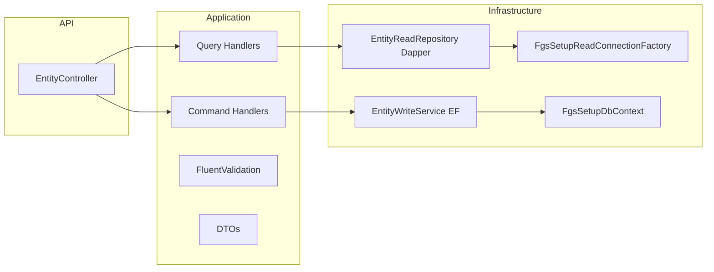

# Setup Entity CRUD Template

Reusable guide for implementing manual CQRS CRUD on tenant-scoped `FgsSetup*` entities in Setup Service.

**Reference implementation:** `FgsSetupTechTrade` (`/api/v1/techtrade`)

## Architecture



## Endpoint checklist

| Method | Route | Purpose |
|--------|-------|---------|
| GET | `/api/v1/{entity}/{id}` | Get by id |
| GET | `/api/v1/{entity}` | List (page, sort, filter, search) |
| POST | `/api/v1/{entity}` | Create |
| PUT | `/api/v1/{entity}/{id}` | Full update |
| PATCH | `/api/v1/{entity}/{id}` | Partial update; also used for soft delete (`{ "isActive": false }`) |
| DELETE | `/api/v1/{entity}/{id}` | Soft delete — **only on select modules** (see below) |
| GET | `/api/v1/{entity}/lookup` | Lightweight id/code/name projection |

Use `[FgsVersionedRoute("{entity}")]` — routes are `/api/v1/...`, not `/api/setup/...`.

### Route naming

Prefer **singular** route segments for catalog resources where the API has been standardized:

| Route | Controller |
|-------|------------|
| `techtrade` | `TechTradeController` |
| `techskilllevel` | `TechSkillLevelController` |
| `timeslot` | `TimeslotController` |
| `titleofcourtesy` | `TitleOfCourtesyController` |
| `vehiclemaintenance` | `VehicleMaintenanceController` |
| `vehicle` | `VehicleController` |
| `zone` | `ZoneController` |
| `tax` | `TaxController` |

Other catalogs may remain plural (e.g. `paymentmethods`, `billingcategories`). Match existing neighbors in `Fgs.Setup.API/Controllers`.

### List query conventions

```csharp
[FromQuery] bool? isActive = null   // null = all; true/false = filtered
```

`SetupListQuery` defaults `IsActive` to `null`. Read repositories skip the `IsActive` filter when the value is null.

Set a controller/repo default `sortBy` when the product expects a stable order (e.g. `SortOrder` for labor rate types, `Name` for payment terms/zones).

### Lookup conventions

```csharp
[FromQuery] bool activeOnly = true  // default: active records only
```

When `activeOnly` is true, SQL must include `IsActive = TRUE`.

Add optional lookup filters per entity when needed (e.g. `isMobileVisible`, `isCustomerPortalVisible` on payment methods and time slots; `showToFieldTech` on billing categories). Billing-category lookup always enforces `IsActive = TRUE AND AllowToPick = TRUE` regardless of `activeOnly`.

### HTTP DELETE vs PATCH soft delete

**Default:** no `[HttpDelete]` on the controller. Soft-delete via `PATCH { "isActive": false }`; reactivate via `PATCH { "isActive": true }`. Delete command handlers may remain in Application for internal reuse and unit tests.

**Expose `[HttpDelete]`** only for these modules:

- BillingCategories, BusinessTypes, Tax, TaxAuthorities
- SalesDispositionReasons, SalesPipelineStatuses, LeadDisqualificationReasons
- Vehicle, CommunicationTemplates, Credentials

When using `scripts/generate_setup_crud.py`, set `expose_http_delete=True` on the `EntityConfig` for modules that keep DELETE.

## Folder layout

```
Fgs.Setup.Application/
  Abstractions/{Entities}/
    I{Entity}ReadRepository.cs
    I{Entity}WriteService.cs
  Abstractions/Persistence/
    ISetupReadConnectionFactory.cs
  Common/SetupCrud/
    SetupListQuery.cs
  Features/{Entities}/
    Dtos/{Entity}Dtos.cs
    Commands/          # Create, Update, Patch, Delete + handlers
    Queries/           # GetById, List, Lookup + handlers
    Validators/

Fgs.Setup.Infrastructure/
  Database/Read/
    FgsSetupReadConnectionFactory.cs
  {Entities}/
    {Entity}ReadRepository.cs
    {Entity}WriteService.cs
    {Entity}Sql.cs
  Common/
    SetupEntityAuditHelper.cs

Fgs.Setup.API/Controllers/
  {Entity}Controller.cs

Fgs.Setup.Tests/{Entities}/
  {Entity}ValidatorTests.cs
  {Entity}CommandHandlerTests.cs
  {Entity}QueryHandlerTests.cs
  {Entity}LookupQueryHandlerTests.cs   # when lookup has non-trivial filters
```

## Read side (Dapper)

- Use `ISetupReadConnectionFactory` with `ConnectionStrings:FgsSetupReadOnly`.
- Scope all queries by `TenantId` and `CompanyId` from `ITenantContextAccessor`.
- List: dynamic SQL with whitelist sort columns, `LIMIT/OFFSET`, separate `COUNT(*)`.
- Apply `IsActive` filter only when `SetupListQuery.IsActive` has a value.
- Reuse `PagedQuery`, `PagedResult<T>`, `SortDirection` from `Fgs.Foundation.CatalogCrud`.
- `Exists*` methods support validators (with optional `excludeId`).
- Trim detail DTOs when summary/create/update/patch already expose flags (e.g. omit `IsActive` from GetById when appropriate).

## Write side (EF Core)

- Use `FgsSetupDbContext` + `IUnitOfWork`.
- Stamp audit via `SetupEntityAuditHelper` (`CreatedOn/By`, `UpdatedOn/By`; actor from `IFgsUserContext`).
- Set `TenantId`/`CompanyId` from user context on create.
- Soft delete only: set `IsActive = false` (no `DeletedOn`/`DeletedBy` columns).
- Catch `DbUpdateException` for unique violations (`23505`) → `InvalidOperationException` (409 via `CatalogCrudExceptionMapper`).
- Add delete guards in write services when references exist (e.g. TaxAuthority → active tax details → 409).

## Validation

- FluentValidation on commands; async duplicate checks via read repository.
- Normalize codes (e.g. uppercase) in write service and validate in validators.
- Required fields, max lengths, numeric constraints (match DB check constraints where applicable).

## Error handling and logging

- Global: `ExceptionHandlingMiddleware` + MediatR `ValidationBehavior` via `AddFgsFoundation()`.
- Handlers: try/catch → `CatalogCrudExceptionMapper.MapException<T>()`.
- Log create/update/delete at Information; failures at Error.

## Step-by-step clone checklist

1. Confirm entity shape, unique constraints, and soft-delete rules in EF configuration.
2. Add DTOs and application abstractions (`I*ReadRepository`, `I*WriteService`).
3. Implement `{Entity}Sql.cs` (table name, column lists, allowed sort columns, default `ORDER BY`).
4. Implement Dapper read repository (get, list, lookup, exists).
5. Implement EF write service + reuse `SetupEntityAuditHelper`.
6. Add MediatR commands/queries, handlers, and FluentValidation validators.
7. Add thin controller: `isActive = null` on list, `activeOnly = true` on lookup, PATCH for soft delete; add `[HttpDelete]` only if the module is in the DELETE allowlist.
8. Register services in `Fgs.Setup.Infrastructure/DependencyInjection.cs`.
9. Add unit tests (validators, command handlers with in-memory DbContext, query handlers with mocks; lookup tests when filters are non-trivial).
10. Update gateway routes if the path is proxied explicitly (`src/Gateway/conf.d/includes/api-v1-routes.conf`).
11. Regenerate Postman: `docs/api/scripts/Generate-PostmanCollections.ps1` (update controller-specific sample bodies when renaming controllers).
12. Build and test: `dotnet build` + `dotnet test` on `Fgs.Setup.Tests`.

## Codegen

`src/SetupService/scripts/generate_setup_crud.py` scaffolds new catalog modules. Conventions aligned with this template:

- `isActive = null` on list endpoints
- `activeOnly = true` on lookup
- `expose_http_delete=False` by default; opt in per entity
- Singular routes/controllers for entities listed above

Do not bulk-regenerate existing modules; apply targeted edits to generated output.

## TechTrade reference files

| Area | Path |
|------|------|
| Entity | `src/SetupService/Fgs.Setup.Domain/Entities/FgsSetupTechTrade.cs` |
| Controller | `src/SetupService/Fgs.Setup.API/Controllers/TechTradeController.cs` |
| Read repo | `src/SetupService/Fgs.Setup.Infrastructure/TechTrades/TechTradeReadRepository.cs` |
| Write service | `src/SetupService/Fgs.Setup.Infrastructure/TechTrades/TechTradeWriteService.cs` |
| Tests | `src/SetupService/Fgs.Setup.Tests/TechTrades/` |
