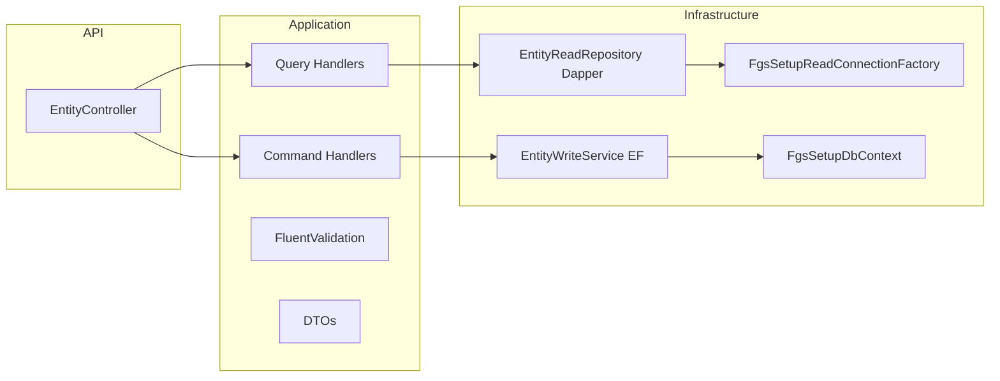

# Setup Entity CRUD Template

Reusable guide for implementing manual CQRS CRUD on tenant-scoped `FgsSetup*` entities in Setup Service.

**Reference implementation:** `FgsSetupTechTrade` (`/api/v1/techtrades`)

## Architecture



## Endpoint checklist

| Method | Route | Purpose |
|--------|-------|---------|
| GET | `/api/v1/{entities}/{id}` | Get by id |
| GET | `/api/v1/{entities}` | List (page, sort, filter, search) |
| POST | `/api/v1/{entities}` | Create |
| PUT | `/api/v1/{entities}/{id}` | Full update |
| PATCH | `/api/v1/{entities}/{id}` | Partial update |
| DELETE | `/api/v1/{entities}/{id}` | Soft delete (`IsActive = false`) |
| GET | `/api/v1/{entities}/lookup` | Lightweight id/code/name projection |
| GET | `/api/v1/{entities}/active` | List with `isActive=true` |

Use `[FgsVersionedRoute("{entities}")]` — routes are `/api/v1/...`, not `/api/setup/...`.

## Folder layout

```
Fgs.Setup.Application/
  Abstractions/{Entities}/
    I{Entity}ReadRepository.cs
    I{Entity}WriteService.cs
  Abstractions/Persistence/
    ISetupReadConnectionFactory.cs
  Common/SetupCrud/
    SetupListQuery.cs
  Features/{Entities}/
    Dtos/{Entity}Dtos.cs
    Commands/          # Create, Update, Patch, Delete + handlers
    Queries/           # Get, List, Lookup, Active + handlers
    Validators/

Fgs.Setup.Infrastructure/
  Database/Read/
    FgsSetupReadConnectionFactory.cs
  {Entities}/
    {Entity}ReadRepository.cs
    {Entity}WriteService.cs
    {Entity}Sql.cs
  Common/
    SetupEntityAuditHelper.cs

Fgs.Setup.API/Controllers/
  {Entities}Controller.cs

Fgs.Setup.Tests/{Entities}/
  {Entity}ValidatorTests.cs
  {Entity}CommandHandlerTests.cs
  {Entity}QueryHandlerTests.cs
```

## Read side (Dapper)

- Use `ISetupReadConnectionFactory` with `ConnectionStrings:FgsSetupReadOnly`.
- Scope all queries by `TenantId` and `CompanyId` from `ITenantContextAccessor`.
- List: dynamic SQL with whitelist sort columns, `LIMIT/OFFSET`, separate `COUNT(*)`.
- Reuse `PagedQuery`, `PagedResult<T>`, `SortDirection` from `Fgs.Foundation.CatalogCrud`.
- `Exists*` methods support validators (with optional `excludeId`).

## Write side (EF Core)

- Use `FgsSetupDbContext` + `IUnitOfWork`.
- Stamp audit via `SetupEntityAuditHelper` (`CreatedOn/By`, `UpdatedOn/By`; actor from `IFgsUserContext`).
- Set `TenantId`/`CompanyId` from user context on create.
- Soft delete only: set `IsActive = false` (no `DeletedOn`/`DeletedBy` columns).
- Catch `DbUpdateException` for unique violations (`23505`) → `InvalidOperationException` (409 via `CatalogCrudExceptionMapper`).

## Validation

- FluentValidation on commands; async duplicate checks via read repository.
- Normalize codes (e.g. uppercase) in write service and validate in validators.
- Required fields, max lengths, numeric constraints (match DB check constraints where applicable).

## Error handling and logging

- Global: `ExceptionHandlingMiddleware` + MediatR `ValidationBehavior` via `AddFgsFoundation()`.
- Handlers: try/catch → `CatalogCrudExceptionMapper.MapException<T>()`.
- Log create/update/delete at Information; failures at Error.

## Step-by-step clone checklist

1. Confirm entity shape, unique constraints, and soft-delete rules in EF configuration.
2. Add DTOs and application abstractions (`I*ReadRepository`, `I*WriteService`).
3. Implement `{Entity}Sql.cs` (table name, column lists, allowed sort columns).
4. Implement Dapper read repository (get, list, lookup, exists).
5. Implement EF write service + reuse `SetupEntityAuditHelper`.
6. Add MediatR commands/queries, handlers, and FluentValidation validators.
7. Add thin `[Authorize]` controller with all REST endpoints (`lookup`/`active` before `{id}`).
8. Register services in `Fgs.Setup.Infrastructure/DependencyInjection.cs`.
9. Add unit tests (validators, command handlers with in-memory DbContext, query handlers with mocks).
10. Regenerate Postman: `docs/api/scripts/Generate-PostmanCollections.ps1`.
11. Build and test: `dotnet build` + `dotnet test` on `Fgs.Setup.Tests`.

## TechTrade reference files

| Area | Path |
|------|------|
| Entity | `src/SetupService/Fgs.Setup.Domain/Entities/FgsSetupTechTrade.cs` |
| Controller | `src/SetupService/Fgs.Setup.API/Controllers/TechTradesController.cs` |
| Read repo | `src/SetupService/Fgs.Setup.Infrastructure/TechTrades/TechTradeReadRepository.cs` |
| Write service | `src/SetupService/Fgs.Setup.Infrastructure/TechTrades/TechTradeWriteService.cs` |
| Tests | `src/SetupService/Fgs.Setup.Tests/TechTrades/` |
