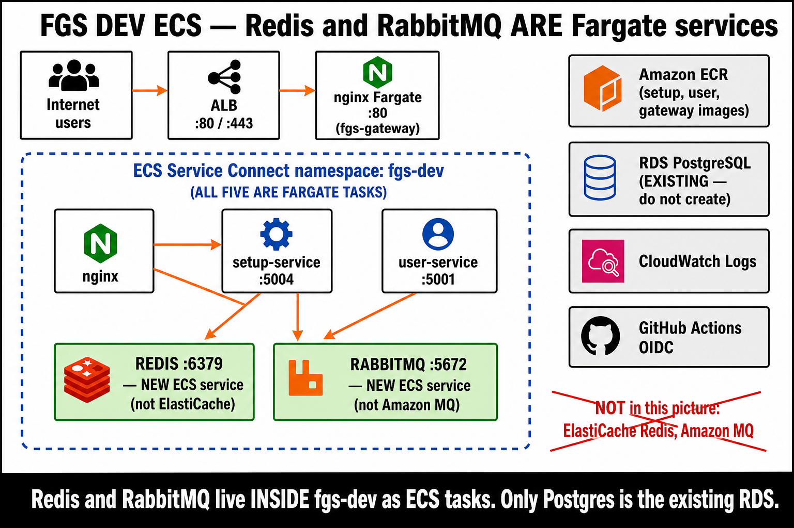
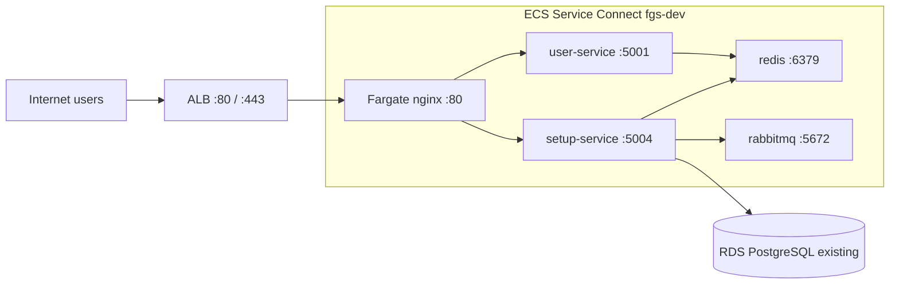
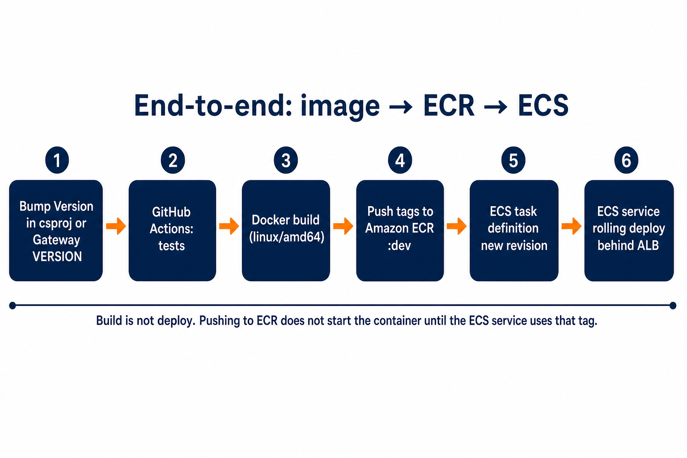
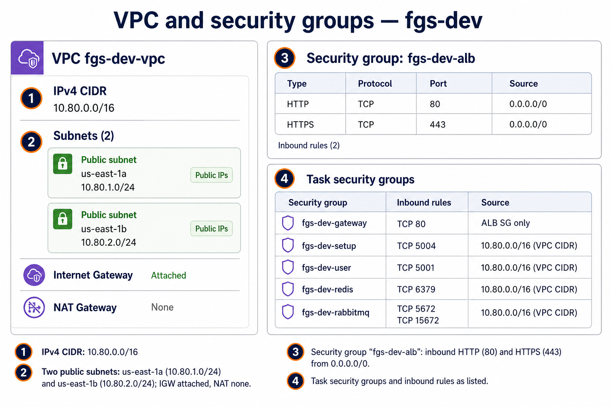
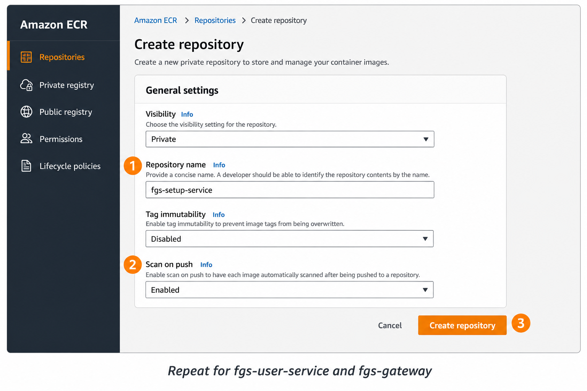
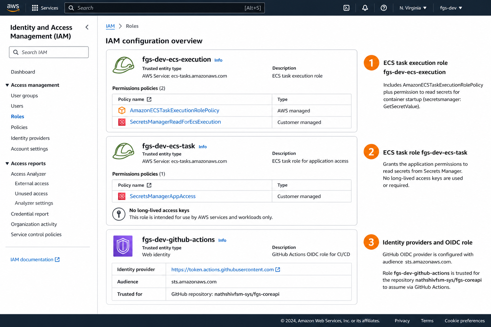
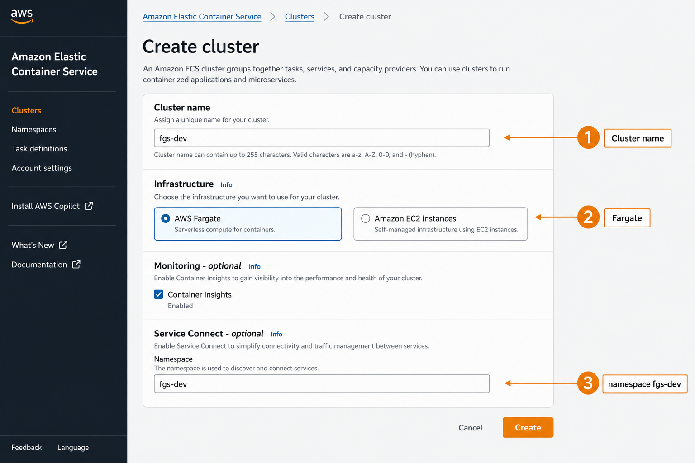
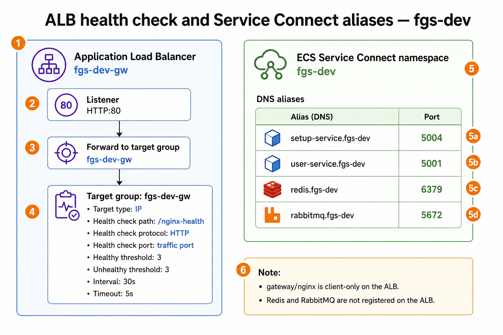
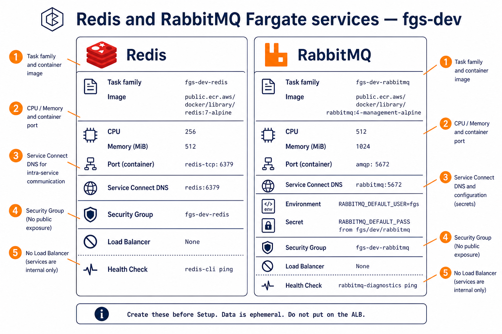
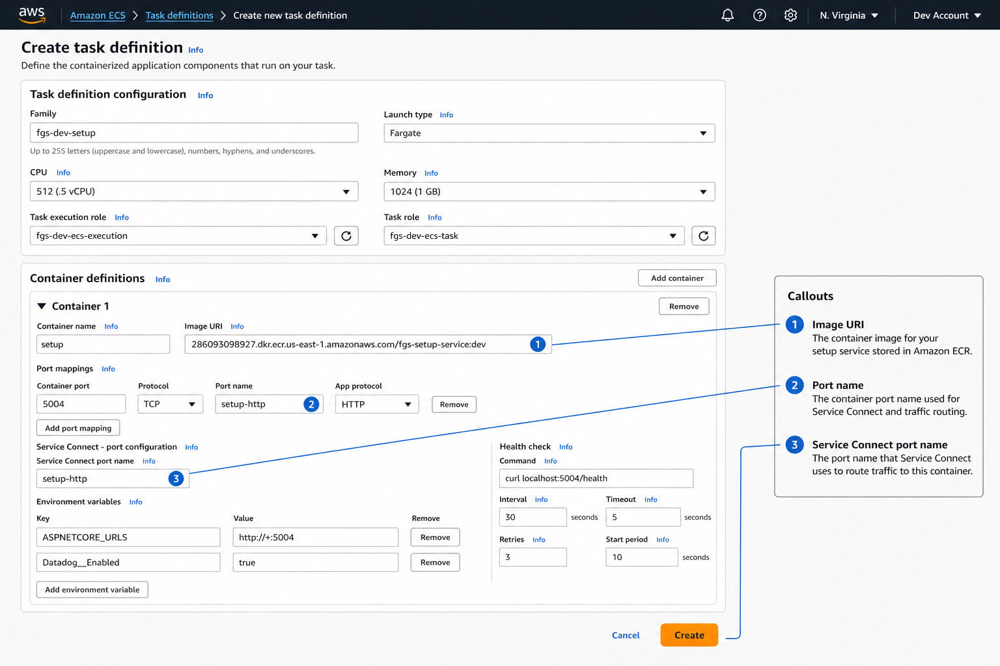

# Manual AWS deploy  -  nginx, Setup, User, Redis, RabbitMQ (**dev**)

Dev infrastructure for nginx, Setup, User, Redis, and RabbitMQ on ECS Fargate: VPC, ECR, IAM, cluster, Service Connect, ALB, then images and services.

Figures are **annotated console maps** (same field names as the AWS Console). They are not screenshots of your account.

**Do not put Datadog keys, DB passwords, or AWS access keys in git, Dockerfiles, or this guide.** Datadog `ApiKey` lives in Setup `glo.GloCredential` (Global `DATADOG`).

Terraform: [../terraform/README.md](../terraform/README.md) (`environment = "dev"`, ALB on, Redis + RabbitMQ Fargate). This document is the **console** path and includes **User**, **Redis**, and **RabbitMQ**.

Dev services run **continuously** (desired count 1). See [Estimated monthly cost](#estimated-monthly-cost-dev-stack).

---

## What you will have when you finish

Testers hit **nginx** through the **ALB** (`http://<alb-dns>/`). Setup and User stay private on ECS Service Connect (`setup-service:5004`, `user-service:5001`). Redis (`redis:6379`) and RabbitMQ (`rabbitmq:5672`) run as Fargate services in the same namespace.





| Piece | Dev value |
| --- | --- |
| Region | Same region as **existing** RDS |
| Cluster / namespace | `fgs-dev` |
| Setup | **`setup-service:5004`**, 512 CPU / 1024 MB, Fargate On-Demand |
| User | **`user-service:5001`**, 512 CPU / 1024 MB, Fargate On-Demand |
| Gateway | `fgs-gateway` :80 behind ALB, 256 CPU / 512 MB |
| Redis | **`redis:6379`**, 256 CPU / 512 MB, Fargate On-Demand |
| RabbitMQ | **`rabbitmq:5672`**, 512 CPU / 1024 MB, Fargate On-Demand |
| ECR | one repo `fgs/dockers` (tags `setup-dev`, `user-dev`, `nginx-dev`) |
| Image tag | `setup-dev` / `user-dev` / `nginx-dev` (channel for the `dev` branch) |
| Entry URL | `http://<alb-dns>/nginx-health` |
| HTTPS | Optional later (ACM)  -  HTTP is enough until you have a domain |

Reuse existing **RDS (PostgreSQL)**. This guide **creates Redis and RabbitMQ** as ECS services (same pattern as local `docker compose`). Do not add NAT, extra APIs, or a Datadog Agent sidecar for this slice.

Build is not deploy. Pushing to ECR does not start a container until an ECS **service** uses that tag.



---

## Order of work

1. **Network**  -  VPC, **two public subnets**, security groups (including ALB, Redis, RabbitMQ). Open existing RDS. **No NAT** (tasks use a public IP to pull images).
2. **Registry**  -  one ECR repository `fgs/dockers` ([A4](#a4-amazon-ecr-one-shared-image-repository)).
3. **Identity**  -  ECS execution role, ECS task role, GitHub OIDC role.
4. **Logs**  -  CloudWatch log groups, retention **14 days**.
5. **Cluster**  -  ECS Fargate, namespace `fgs-dev`.
6. **Redis + RabbitMQ**  -  Fargate services in that namespace ([A11](#a11-redis-and-rabbitmq-ecs-services)).
7. **ALB**  -  target group health `/nginx-health`.
8. **Images**  -  GitHub Actions (or local Docker) -> ECR.
9. **Tasks + services**  -  Setup, then User, then nginx (attached to the ALB).
10. **Prove it**  -  `http://<alb-dns>/nginx-health`.

HTTPS ([A10](#a10-https-certificate-acm--alb)) is optional. You do **not** install nginx on EC2.

---

## Estimated monthly cost (dev stack)

Figures are **list prices for US East (N. Virginia / `us-east-1`)**, Linux/x86 Fargate, rounded. Other regions cost more. Confirm in the [AWS Pricing Calculator](https://calculator.aws/). **Not a quote**  -  AWS can change rates.

**Assumptions:** services run **24/7**; one task each of Setup (0.5 vCPU / 1 GB), User (0.5 vCPU / 1 GB), nginx (0.25 vCPU / 0.5 GB), Redis (0.25 vCPU / 0.5 GB), RabbitMQ (0.5 vCPU / 1 GB); one ALB; no NAT; existing RDS **not** included.

Fargate rates used: **$0.04048 / vCPU-hour** and **$0.004445 / GB-hour**. ALB: **$0.0225 / hour** (~$16.40 / month) plus a small LCU charge for typical traffic.

| Line item | ~Monthly (24/7) |
| --- | --- |
| Fargate (Setup + User + nginx + Redis + RabbitMQ) | **~$72** |
| Public IPv4 on the five tasks (`$0.005`/hour each) | **~$18** |
| Application Load Balancer (hourly + light LCU) | **~$16-18** |
| ECR storage (three app images) | **~$0-1** |
| CloudWatch Logs (14-day retention) | **~$3-6** |
| Secrets Manager (RabbitMQ password; plus Setup DB if you store it) | **~$0.40-1** |
| VPC, IAM, ECS cluster, Service Connect, ACM | **$0** extra |
| **Total this guide (new AWS spend)** | **about $100-120 / month** |

**Not in the total (already in your account):** hosted PostgreSQL, KMS, Datadog.

This is **cheaper than** Amazon ElastiCache + Amazon MQ for the same slice (those managed services are typically ~$40-80 extra on their own for the smallest nodes). Redis/RabbitMQ here are **single Fargate tasks**, not Multi-AZ.

**How the Fargate figure is built**

| Task | Size | $/hour |
| --- | --- | --- |
| Setup | 0.5 vCPU, 1 GB | ≈ $0.025 |
| User | 0.5 vCPU, 1 GB | ≈ $0.025 |
| nginx | 0.25 vCPU, 0.5 GB | ≈ $0.012 |
| Redis | 0.25 vCPU, 0.5 GB | ≈ $0.012 |
| RabbitMQ | 0.5 vCPU, 1 GB | ≈ $0.025 |
| **All five** | | **≈ $0.099 / hour** |

730 hours/month à -  $0.099 ≈ **$72**.

---

# Part A  -  AWS dependencies (console)

Sign in to [AWS Console](https://console.aws.amazon.com/). Top-right: pick the **region** you will use for everything in this guide (ECR, ECS, ALB, IAM roles are global but used from that region).

Suggested names below use environment **dev** (`fgs-dev-...`).

## A1. VPC and subnets

**Skip this if you already have a VPC with at least two public subnets** (two Availability Zones, route `0.0.0.0/0` to an Internet Gateway). Write down `vpc-...` and two `subnet-...` IDs.

Otherwise:

1. Open **VPC** -> **Your VPCs** -> **Create VPC**.
2. Choose **VPC and more**.
3. Name tag: `fgs-dev`.
4. IPv4 CIDR: `10.80.0.0/16` (or another unused CIDR).
5. Number of AZs: **2** (required for the ALB).
6. Public subnets: **2**. Private subnets: **0**.
7. NAT gateways: **None** (Fargate uses a public IP to pull ECR).
8. VPC endpoints: **None**.
9. Create VPC.

You need:

- VPC ID
- Two **public** subnet IDs
- CIDR (for security-group rules)



## A2. Security groups

**VPC** -> **Security groups** -> **Create security group**. Create **six**.

### `fgs-dev-alb`

Inbound:

| Type | Port | Source |
| --- | --- | --- |
| HTTP | 80 | `0.0.0.0/0` |
| HTTPS | 443 | `0.0.0.0/0` |

Outbound: all traffic.

### `fgs-dev-gateway` (nginx)

Inbound: HTTP **80** from security group `fgs-dev-alb` only.

Outbound: all (needs ECR, Service Connect, DNS).

### `fgs-dev-setup`

Inbound: TCP **5004** from the **VPC CIDR** (so nginx and Service Connect can reach Setup).

Outbound: all (RDS, Redis, RabbitMQ, ECR, KMS, Secrets Manager, Datadog HTTPS).

### `fgs-dev-user`

Inbound: TCP **5001** from the **VPC CIDR**.

Outbound: all.

### `fgs-dev-redis`

Inbound: TCP **6379** from the **VPC CIDR** (Setup, User, later APIs).

Outbound: all (needed to pull the Redis image).

### `fgs-dev-rabbitmq`

Inbound:

| Type | Port | Source |
| --- | --- | --- |
| Custom TCP | 5672 | VPC CIDR (AMQP) |
| Custom TCP | 15672 | VPC CIDR (management UI  -  **not** on the ALB) |

Outbound: all.

## A3. Open hosted PostgreSQL

Do **not** create a new RDS instance for this slice. Use the Postgres you already host.

On the **RDS** security group, add inbound from the Fargate task SGs (or the VPC CIDR):

| Store | Port | Source |
| --- | --- | --- |
| PostgreSQL (Setup DB) | 5432 | `fgs-dev-setup` (also allow `fgs-dev-user` if User talks to Postgres directly) |

Redis and RabbitMQ are **new ECS services** in this guide ([A11](#a11-redis-and-rabbitmq-ecs-services)), not extra SGs on an existing cache/broker. If you already have ElastiCache / Amazon MQ and prefer those, skip A11 and allow **6379** / **5671-5672** from `fgs-dev-setup` and `fgs-dev-user` instead.

If RDS is in **another region or another VPC**, you need peering / TGW / public RDS with a tight SG. Same-VPC same-region is the simple path.

## A4. Amazon ECR (one shared image repository)

Create this **before** you build or start ECS tasks. ECR is only storage for Docker images. It is **not** an ECS service and **not** a running container.

Use **one private repository** for Setup, User, and nginx. Services are distinguished by **tags** (not separate repos):

| Tag on `dev` | Image | Dockerfile |
| --- | --- | --- |
| `setup-dev` | Setup API | `src/Gateway/docker/setup-service.Dockerfile` |
| `user-dev` | User API | `src/Gateway/docker/user-service.Dockerfile` |
| `nginx-dev` | nginx | `src/Gateway/Dockerfile.prod` |

Also pushed: `setup-<version>-dev`, `setup-<version>-dev-<sha>` (same pattern for `user` / `nginx`). Channel tags for `test` / `main` are `*-test` and `*-prod`.

GitHub Actions variable `ECR_REPO` defaults to `fgs/dockers`.



### A4.1 Create repository `fgs/dockers`

1. Top-right: confirm the **same region** as ECS (for example `us-east-1`).
2. Open **Amazon ECR** -> **Private registry** -> **Repositories**.
3. **Create repository**.
4. Visibility: **Private**.
5. Repository name: `fgs/dockers` (do not use a different path unless you also change `ECR_REPO`).
6. Tag immutability: **Disabled** (so `setup-dev` can be overwritten on each build).
7. Image scan on push: **Enabled** (optional).
8. Encryption: **AES-256** (default) is fine.
9. **Create**.
10. Open the repository -> copy **URI**:
    `ACCOUNT.dkr.ecr.REGION.amazonaws.com/fgs/dockers`

The registry host alone (`ACCOUNT.dkr.ecr.REGION.amazonaws.com`) is not a repository. You must see **`fgs`** under Repositories.

### A4.2 Lifecycle (limit stored images)

1. Open `fgs` -> **Lifecycle policy** -> **Create rule**.
2. Rule priority: `1`.
3. Image status: **Any**.
4. Match criteria: **Image count more than** `60` (shared repo holds three services).
5. Action: **Expire**.
6. Save.

### A4.3 Confirm before the first push

**Repositories** should list **`fgs/dockers`**. The **Images** tab is empty until Part B. Empty is expected.

Optional CLI:

```powershell
aws ecr create-repository --repository-name fgs/dockers --image-scanning-configuration scanOnPush=true --region YOUR_REGION
```

If the name already exists, skip. Then continue to IAM (A6.3 GitHub role must allow push to `arn:aws:ecr:REGION:ACCOUNT:repository/fgs/dockers`).

---

**CloudWatch** -> **Log groups** -> **Create log group** (retention **14 days**):

| Name | Retention |
| --- | --- |
| `/ecs/fgs-dev/setup` | 14 days |
| `/ecs/fgs-dev/user` | 14 days |
| `/ecs/fgs-dev/gateway` | 14 days |
| `/ecs/fgs-dev/redis` | 14 days |
| `/ecs/fgs-dev/rabbitmq` | 14 days |

## A6. IAM roles

Open **IAM**. You need three roles.



### A6.1 ECS task execution role  -  `fgs-dev-ecs-execution`

Used by ECS **to start** the task (pull image, write logs, read secrets into env).

1. **Roles** -> **Create role**.
2. Trusted entity: **AWS service** -> **Elastic Container Service** -> use case **Elastic Container Service Task**.
3. Attach managed policy **AmazonECSTaskExecutionRolePolicy**.
4. Name: `fgs-dev-ecs-execution`.
5. After create, **Add inline policy** so ECS can inject Secrets Manager values (Setup DB if used, and the RabbitMQ password):

```json
{
  "Version": "2012-10-17",
  "Statement": [
    {
      "Effect": "Allow",
      "Action": ["secretsmanager:GetSecretValue"],
      "Resource": "arn:aws:secretsmanager:REGION:ACCOUNT:secret:fgs/dev/setup/db*"
    },
    {
      "Effect": "Allow",
      "Action": ["secretsmanager:GetSecretValue"],
      "Resource": "arn:aws:secretsmanager:REGION:ACCOUNT:secret:fgs/dev/rabbitmq*"
    }
  ]
}
```

### A6.2 ECS task role  -  `fgs-dev-ecs-task`

Used by the **application** at runtime (Setup credential vault, KMS). **Do not** put `AKIA...` keys in the task. The task role is enough when `AwsCredentials__EnableLocalProfileFallback=false`.

1. Create role, same trust as above (`ecs-tasks.amazonaws.com`).
2. Inline policy (tighten later):

```json
{
  "Version": "2012-10-17",
  "Statement": [
    {
      "Effect": "Allow",
      "Action": [
        "secretsmanager:GetSecretValue",
        "secretsmanager:CreateSecret",
        "secretsmanager:PutSecretValue",
        "secretsmanager:DescribeSecret"
      ],
      "Resource": "*"
    },
    {
      "Effect": "Allow",
      "Action": ["kms:Decrypt", "kms:GenerateDataKey", "kms:DescribeKey"],
      "Resource": "arn:aws:kms:REGION:ACCOUNT:key/YOUR-KEY-ID"
    }
  ]
}
```

### A6.3 GitHub Actions OIDC (so CI can push images)

1. **IAM** -> **Identity providers** -> **Add provider**.
2. Provider type: **OpenID Connect**.
3. Provider URL: `https://token.actions.githubusercontent.com` -> **Get thumbprint**.
4. Audience: `sts.amazonaws.com`.
5. Add provider (skip if it already exists).
6. **Create role** -> **Web identity** -> that provider, audience `sts.amazonaws.com`.
7. Name: `fgs-dev-github-actions`.
8. Trust policy (replace ACCOUNT, keep your org/repo). Edit the role -> **Trust relationships**:

```json
{
  "Version": "2012-10-17",
  "Statement": [
    {
      "Effect": "Allow",
      "Principal": {
        "Federated": "arn:aws:iam::ACCOUNT:oidc-provider/token.actions.githubusercontent.com"
      },
      "Action": "sts:AssumeRoleWithWebIdentity",
      "Condition": {
        "StringEquals": {
          "token.actions.githubusercontent.com:aud": "sts.amazonaws.com"
        },
        "StringLike": {
          "token.actions.githubusercontent.com:sub": "repo:nathshivfsm-sys/fgs-coreapi:*"
        }
      }
    }
  ]
}
```

9. Permissions: `ecr:GetAuthorizationToken` on `*`, and push/pull on the shared repository ARN:

```json
{
  "Version": "2012-10-17",
  "Statement": [
    {
      "Effect": "Allow",
      "Action": "ecr:GetAuthorizationToken",
      "Resource": "*"
    },
    {
      "Effect": "Allow",
      "Action": [
        "ecr:BatchCheckLayerAvailability",
        "ecr:GetDownloadUrlForLayer",
        "ecr:BatchGetImage",
        "ecr:PutImage",
        "ecr:InitiateLayerUpload",
        "ecr:UploadLayerPart",
        "ecr:CompleteLayerUpload",
        "ecr:DescribeRepositories",
        "ecr:DescribeImages"
      ],
      "Resource": [
        "arn:aws:ecr:REGION:ACCOUNT:repository/fgs/dockers"
      ]
    }
  ]
}
```

Copy the role ARN (`arn:aws:iam::ACCOUNT:role/fgs-dev-github-actions`). Next: GitHub variables in [B1](#b1-connect-github-actions-to-ecr).

## A7. Optional: Secrets Manager for Setup DB and RabbitMQ

**Secrets Manager** -> **Store a new secret** -> **Other type of secret**.

### Setup DB (if the connection string is not baked elsewhere)

Name: `fgs/dev/setup/db`

Plaintext connection string (example, **not** a real password):

```text
Host=YOUR_RDS_HOST;Port=5432;Database=YOUR_DB;Username=YOUR_USER;Password=YOUR_PASSWORD
```

### RabbitMQ password (required when you create the RabbitMQ task in A11)

Name: `fgs/dev/rabbitmq`

Plaintext: a long random password (letters and digits). ECS injects it as `RABBITMQ_DEFAULT_PASS` and Setup as `RabbitMq__Password`.

Do **not** create a Datadog secret for the app. The API key is already in the Setup credential table.

Do **not** put the RabbitMQ password in git or in this guide.

## A8. ECS cluster and Service Connect namespace

1. Open **Elastic Container Service** -> **Clusters** -> **Create cluster**.
2. Cluster name: `fgs-dev`.
3. Infrastructure: **AWS Fargate**.
4. Monitoring: Container Insights **off** unless you need it (extra CloudWatch cost).
5. **Service Connect** default namespace: create **`fgs-dev`** (HTTP namespace).
6. Create.



If the namespace wizard is missing: **Cloud Map** -> **Namespaces** -> **Create namespace** -> instance discovery **API calls** -> name `fgs-dev`. Then edit the cluster's Service Connect default to that namespace.

## A9. Application Load Balancer

Create the ALB **before** the nginx ECS service (the service registers into the target group). Testers use this hostname; it stays the same when tasks are replaced on deploy.

The ALB still bills while it exists. Do **not** delete it unless you are tearing down the environment.

1. **EC2** -> **Load Balancers** -> **Create** -> **Application Load Balancer**.
2. Name: `fgs-dev-gw`.
3. Scheme: **Internet-facing**.
4. IP address type: IPv4.
5. VPC: your VPC. Mappings: **both public subnets**.
6. Security group: `fgs-dev-alb`.
7. Listeners: HTTP **80** -> a **new target group**:
   - Name: `fgs-dev-gw`
   - Target type: **IP** (required for Fargate)
   - Protocol: HTTP, port **80**
   - VPC: same
   - Health check path: **`/nginx-health`**
   - Matcher: `200`
8. Do **not** register IPs by hand. ECS will register tasks.
9. Create ALB.

Use `http://<alb-dns>` for this environment. For **HTTPS**, continue to [A10](#a10-https-certificate-acm--alb).



## A10. HTTPS certificate (ACM -> DNS -> ALB)

Optional. HTTP on the ALB is enough until you have a domain. ACM is free; you need a domain you control.

**Public HTTPS needs a TLS certificate.** Put it on the **ALB**, not on Setup/User, and not in git.

| Path | Certificate? |
| --- | --- |
| Browser / Postman -> ALB | **Yes** (ACM), if you want `https://` |
| ALB -> nginx :80 | No (HTTP inside the VPC) |
| nginx -> `setup-service:5004` / `user-service:5001` | No |

ACM is **free** for certs attached to an ALB. You need a **domain you control** (for example `dev.fsm.com` or `developer.fsm.com`). ACM will not issue a trusted cert for the raw `*.elb.amazonaws.com` ALB name.

You can stay HTTP-only until the domain and cert are ready. Suggested names: `dev.fsm.com` / `*.dev.fsm.com`.

### A10.1 Request the certificate

1. Open **AWS Certificate Manager** in the **same region as the ALB** (for example `us-east-1`).
2. **Request certificate** -> **Request a public certificate**.
3. Domain names, for example:
   - `dev.fsm.com`
   - optional: `*.dev.fsm.com` if you want a wildcard
4. Validation method: **DNS validation** (preferred).
5. Key algorithm: **RSA 2048** is fine.
6. **Request**.

### A10.2 Prove you own the domain

ACM shows a **CNAME** name and value.

- **Route 53** for that zone: click **Create records in Route 53**.
- **Other DNS** (GoDaddy, Cloudflare, etc.): add that CNAME in the DNS panel.

Wait until the certificate status is **Issued** (often a few minutes, sometimes up to ~30).

Do **not** download the private key. ACM keeps it. You only use the certificate **ARN** on the ALB.

### A10.3 Point the domain at the ALB

| DNS | Type | Name | Value |
| --- | --- | --- | --- |
| Route 53 | **A  -  Alias** | `dev.fsm.com` | the ALB `fgs-dev-gw` |
| Other DNS | **CNAME** | `dev.fsm.com` | ALB DNS, e.g. `fgs-dev-gw-....elb.amazonaws.com` |

### A10.4 Attach the certificate to the ALB

1. **EC2** -> **Load Balancers** -> `fgs-dev-gw`.
2. **Add listener**: protocol **HTTPS**, port **443**.
3. Certificate source: **From ACM** -> the certificate you just issued.
4. Default action: **Forward** to target group `fgs-dev-gw` (nginx :80).
5. On the HTTP **80** listener: **Redirect** to HTTPS 443 (optional but recommended once HTTPS works).

After that, use `https://dev.fsm.com`. Nginx stays on HTTP :80; the ALB terminates TLS. Keep the nginx **command override** from [C3](#c3-nginx--task-definition-fgs-dev-gateway) so `site.prod.conf` does not 301 `:80` -> `:443` and loop through the ALB.

Confirm security group `fgs-dev-alb` already allows inbound **443** (created in [A2](#a2-security-groups)).

### A10.5 If you do not have a domain yet

Buy or transfer one (Route 53 or any registrar), create a hosted zone, then do A10.1-A10.4. There is no trusted public HTTPS without a domain.

### A10.6 What not to do

- Do not put `tls.crt` / `tls.key` in git for this ALB design.
- Do not buy a paid SSL from a vendor unless you have a compliance reason; ACM is enough for the ALB.
- A self-signed cert is only for local tests; browsers will warn. Public HTTPS on the ALB should be a real ACM certificate.
- Do not terminate HTTPS on nginx **and** the ALB unless you have a reason; that needs certs inside the container and a different target group (HTTPS :443).

If you use Terraform instead of the console, request the cert as above, then set `acm_certificate_arn` in [../terraform/README.md](../terraform/README.md).

## A11. Redis and RabbitMQ (ECS services)

Create these **after** the cluster ([A8](#a8-ecs-cluster-and-service-connect-namespace)) and **before** Setup. They use **public images** (Amazon ECR Public). You do **not** build them in GitHub Actions.

Data is stored on the task disk. A new deployment **wipes** Redis keys and RabbitMQ queues. That is acceptable for **dev**.

Do **not** put Redis or RabbitMQ on the ALB.



Images (linux/amd64):

| Service | Image |
| --- | --- |
| Redis | `public.ecr.aws/docker/library/redis:7-alpine` |
| RabbitMQ | `public.ecr.aws/docker/library/rabbitmq:4-management-alpine` |

### A11.1 Redis  -  task definition `fgs-dev-redis`

**ECS** -> **Task definitions** -> **Create new task definition**.

| Field | Value |
| --- | --- |
| Launch type | **Fargate**, Linux, **X86_64** |
| CPU / memory | **256 / 512** |
| Task execution role | `fgs-dev-ecs-execution` |
| Task role | none required |
| Container name | `redis` |
| Image URI | `public.ecr.aws/docker/library/redis:7-alpine` |
| Port mapping | **6379**, TCP, name **`redis-tcp`** (no HTTP app protocol) |
| Health check | `CMD-SHELL`, `redis-cli ping \|\| exit 1`, start period 10s |
| Log group | `/ecs/fgs-dev/redis`, stream prefix `redis` |

Create the task definition.

**Clusters** -> `fgs-dev` -> **Create service**:

| Field | Value |
| --- | --- |
| Family | `fgs-dev-redis` |
| Service name | `redis` |
| Desired tasks | **1** |
| Capacity provider | **FARGATE** |
| Subnets | **both public subnets** |
| Security group | `fgs-dev-redis` |
| Public IP | **Turned on** (pull image without NAT) |
| Load balancer | **None** |
| Service Connect | **Turned on**, namespace `fgs-dev` |
| Port name | `redis-tcp` |
| Discovery name / DNS | **`redis`** |
| Port | **6379** |

Create. Wait until the task is **running** and the health check passes (logs show `PONG` / no restart loop).

### A11.2 RabbitMQ  -  task definition `fgs-dev-rabbitmq`

| Field | Value |
| --- | --- |
| CPU / memory | **512 / 1024** |
| Container name | `rabbitmq` |
| Image URI | `public.ecr.aws/docker/library/rabbitmq:4-management-alpine` |
| Port mappings | **5672** name **`amqp`**; **15672** name **`management`** (TCP, not HTTP on Service Connect) |
| Health check | `CMD-SHELL`, `rabbitmq-diagnostics -q ping \|\| exit 1`, start period **60s** |
| Log group | `/ecs/fgs-dev/rabbitmq` |

**Environment**

| Name | Value |
| --- | --- |
| `RABBITMQ_DEFAULT_USER` | `fgs` |

**Secrets**

| Name | Value from |
| --- | --- |
| `RABBITMQ_DEFAULT_PASS` | `fgs/dev/rabbitmq` |

Create the service:

| Field | Value |
| --- | --- |
| Service name | `rabbitmq` |
| Security group | `fgs-dev-rabbitmq` |
| Public IP | on |
| Load balancer | **None** |
| Service Connect DNS | **`rabbitmq`** port **5672**, port name `amqp` |

Wait until running + healthy (Erlang boot can take a minute).

Do not register port **15672** on the ALB. Management stays inside the VPC.

---

# Part B  -  Connect GitHub to ECR and push images

GitHub Actions never stores long-lived AWS access keys. The runner requests a short GitHub OIDC token, AWS STS exchanges it for the IAM role from [A6.3](#a63-github-actions-oidc-so-ci-can-push-images), then Docker logs in to ECR and **pushes** the image.

```text
git push (dev / test / main)
  -> GitHub Actions (Build setup | Build user | Build nginx)
  -> OIDC assume role AWS_ROLE_TO_ASSUME
  -> docker login to ACCOUNT.dkr.ecr.REGION.amazonaws.com
  -> docker push  .../fgs/dockers:setup-dev  (also user-dev, nginx-dev)
```

## B1. Connect GitHub Actions to ECR

Do this **once** after the shared ECR repo ([A4](#a4-amazon-ecr-one-shared-image-repository)) and the IAM role ([A6.3](#a63-github-actions-oidc-so-ci-can-push-images)) exist.

1. Open the GitHub repo -> **Settings** -> **Secrets and variables** -> **Actions** -> **Variables** -> **New repository variable**.
2. Create:

| Variable | Value |
| --- | --- |
| `AWS_REGION` | Same region as ECR, e.g. `us-east-1` |
| `AWS_ROLE_TO_ASSUME` | `arn:aws:iam::ACCOUNT:role/fgs-dev-github-actions` |
| `ECR_REPO` | `fgs/dockers` (optional; workflow default) |

3. Do **not** add `AWS_ACCESS_KEY_ID` / `AWS_SECRET_ACCESS_KEY`. OIDC is enough. Workflows already have `permissions: id-token: write`.
4. `PUSH_TO_ECR` is **on by default** in `.github/workflows/reusable-build-service.yml`. Set it to `false` only if you want CI to build without publishing.
5. Confirm the IAM trust `sub` is `repo:<owner>/<repo>:*` for **this** repository (wrong org/repo name is the usual `Not authorized to perform sts:AssumeRoleWithWebIdentity` error).
6. Confirm the role can `ecr:PutImage` on `arn:aws:ecr:REGION:ACCOUNT:repository/fgs/dockers`.

## B2. What the YAML does (push to ECR)

| Workflow | Dockerfile | ECR image (on `dev`) |
| --- | --- | --- |
| `build-setup.yml` | `src/Gateway/docker/setup-service.Dockerfile` | `.../fgs/dockers:setup-dev`, `setup-<ver>-dev`, `setup-<ver>-dev-<sha>` |
| `build-user.yml` | `src/Gateway/docker/user-service.Dockerfile` | `.../fgs/dockers:user-dev`, ... |
| `build-nginx.yml` | `src/Gateway/Dockerfile.prod` | `.../fgs/dockers:nginx-dev`, ... |

Shared job: `.github/workflows/reusable-build-service.yml`

- **Pull request:** build + tests only (no ECR login, no push).
- **Push to `dev` / `test` / `main` or Run workflow:** login with OIDC, then `docker/build-push-action` with `push: true`.
- Channel tags: `dev` -> `setup-dev` / `user-dev` / `nginx-dev` (and `*-test`, `*-prod`).

## B3. Version bump (this is what triggers a build)

| Service | File | What to change |
| --- | --- | --- |
| Setup | `src/SetupService/Fgs.Setup.API/Fgs.Setup.API.csproj` | `<Version>` |
| User | `src/UserService/Fgs.User.API/Fgs.User.API.csproj` | `<Version>` |
| nginx | `src/Gateway/VERSION` | plain `1.0.0` style |

Commit to `dev` (or **Actions** -> workflow -> **Run workflow** with **force**).

Workflows:

- **Build setup**  -  `.github/workflows/build-setup.yml`
- **Build user**  -  `.github/workflows/build-user.yml`
- **Build nginx**  -  `.github/workflows/build-nginx.yml`

On success, ECR has:

```text
ACCOUNT.dkr.ecr.REGION.amazonaws.com/fgs/dockers:setup-dev
ACCOUNT.dkr.ecr.REGION.amazonaws.com/fgs/dockers:user-dev
ACCOUNT.dkr.ecr.REGION.amazonaws.com/fgs/dockers:nginx-dev
```

Open **ECR** -> repository -> **Images** and confirm the tags.

## B4. Manual image build (if you are not using Actions)

Install Docker Desktop and AWS CLI. From a PowerShell prompt (repo root). Replace `ACCOUNT` and `REGION`.

```powershell
$ACCOUNT = "YOUR_ACCOUNT_ID"
$REGION  = "us-east-1"
aws ecr get-login-password --region $REGION |
  docker login --username AWS --password-stdin "$ACCOUNT.dkr.ecr.$REGION.amazonaws.com"

# Setup
docker build -f src/Gateway/docker/setup-service.Dockerfile `
  -t "$ACCOUNT.dkr.ecr.$REGION.amazonaws.com/fgs/dockers:setup-dev" .
docker push "$ACCOUNT.dkr.ecr.$REGION.amazonaws.com/fgs/dockers:setup-dev"

# User
docker build -f src/Gateway/docker/user-service.Dockerfile `
  -t "$ACCOUNT.dkr.ecr.$REGION.amazonaws.com/fgs/dockers:user-dev" .
docker push "$ACCOUNT.dkr.ecr.$REGION.amazonaws.com/fgs/dockers:user-dev"

# nginx (context is src/Gateway, not repo root)
docker build -f src/Gateway/Dockerfile.prod `
  -t "$ACCOUNT.dkr.ecr.$REGION.amazonaws.com/fgs/dockers:nginx-dev" src/Gateway
docker push "$ACCOUNT.dkr.ecr.$REGION.amazonaws.com/fgs/dockers:nginx-dev"
```

Images must be **linux/amd64** (Fargate X86_64 in this guide). On Apple Silicon add `--platform linux/amd64`.

---

# Part C  -  Task definitions and ECS services (the running containers)

**ECS** -> **Task definitions** -> **Create new task definition**.

Shared settings for app tasks (Setup / User / nginx):

| Field | Value |
| --- | --- |
| Launch type | **Fargate** |
| Operating system | Linux |
| CPU architecture | **X86_64** |
| CPU / memory | Setup/User **512 / 1024**; nginx **256 / 512** |
| Network mode | awsvpc (automatic on Fargate) |
| Task execution role | `fgs-dev-ecs-execution` |
| Task role | `fgs-dev-ecs-task` |
| Log driver | awslogs, region = your region |

On **Create service**, use **Fargate** (On-Demand). Desired tasks: **1** (services stay running).



Redis and RabbitMQ must already be **running** ([A11](#a11-redis-and-rabbitmq-ecs-services)). Then create **Setup**, then **User**, then **nginx**.

## C1. Setup  -  task definition `fgs-dev-setup`

| Field | Value |
| --- | --- |
| CPU / memory | **512 / 1024** |
| Container name | `setup` |
| Image URI | `.../fgs/dockers:setup-dev` |
| Port mapping | **5004**, TCP, name **`setup-http`**, app protocol HTTP |
| Health check | `CMD-SHELL`, `curl -fsS http://localhost:5004/health \|\| exit 1`, start period 60s |
| Log group | `/ecs/fgs-dev/setup`, stream prefix `setup` |

**Environment** (plain text  -  no API keys):

| Name | Value |
| --- | --- |
| `ASPNETCORE_ENVIRONMENT` | `Development` |
| `ASPNETCORE_URLS` | `http://+:5004` |
| `Datadog__Enabled` | `true` |
| `Datadog__Site` | `datadoghq.com` |
| `Datadog__Env` | `dev` |
| `Observability__Enabled` | `false` |
| `DD_LLMOBS_ENABLED` | `false` |
| `AwsCredentials__Region` | your region |
| `AwsCredentials__EnableLocalProfileFallback` | `false` |
| `AwsCredentials__KmsKeyArn` | your CMK ARN |
| `AwsCredentials__DefaultVaultProvider` | `Database` |
| `UserService__BaseUrl` | `http://user-service:5001` |
| `CredentialDistribution__InternalServiceKey` | same value User will use (prefer a secret later) |
| `Redis__ConnectionString` | `redis:6379` |
| `Redis__Enabled` | `true` |
| `RabbitMq__HostName` | `rabbitmq` |
| `RabbitMq__Port` | `5672` |
| `RabbitMq__UserName` | `fgs` |
| `RabbitMq__SslEnabled` | `false` |

**Secrets** (from Secrets Manager):

| Name | Value from |
| --- | --- |
| `ConnectionStrings__FgsSetup` | `fgs/dev/setup/db` |
| `RabbitMq__Password` | `fgs/dev/rabbitmq` |

Do **not** set `Datadog__ApiKey` or `DD_API_KEY`. Setup reads Global `DATADOG` from `glo.GloCredential`.

Create the task definition.

### Setup service

**Clusters** -> `fgs-dev` -> **Create service**.

| Field | Value |
| --- | --- |
| Family | `fgs-dev-setup` |
| Service name | `setup` |
| Desired tasks | **1** |
| Capacity provider | **FARGATE** (On-Demand) |
| Subnets | **both public subnets** |
| Security group | `fgs-dev-setup` |
| Public IP | **Turned on** (for ECR pull without NAT  -  do not add a NAT gateway) |
| Load balancer | **None** |
| Service Connect | **Turned on**, namespace `fgs-dev` |
| Port name | `setup-http` |
| Discovery name / DNS | **`setup-service`** |
| Port | **5004** |

Create. Wait until running + healthy in **Logs** (`/health` must succeed).

## C2. User  -  task definition `fgs-dev-user`

Same pattern as Setup.

| Field | Value |
| --- | --- |
| CPU / memory | **512 / 1024** |
| Container name | `user` |
| Image URI | `.../fgs/dockers:user-dev` |
| Port mapping | **5001**, name **`user-http`**, HTTP |
| Health check | `curl -fsS http://localhost:5001/health` |
| Log group | `/ecs/fgs-dev/user` |

**Environment:**

| Name | Value |
| --- | --- |
| `ASPNETCORE_ENVIRONMENT` | same as Setup |
| `ASPNETCORE_URLS` | `http://+:5001` |
| `SetupService__BaseUrl` | `http://setup-service:5004` |
| `CredentialDistribution__InternalServiceKey` | **identical** to Setup |
| `CredentialConsumer__ServiceName` | `fgs-user-service` |
| `Redis__ConnectionString` | `redis:6379` |
| `Redis__Enabled` | `true` |
| `Datadog__Enabled` | `true` |
| `Datadog__Site` | `datadoghq.com` |
| `Datadog__Env` | `dev` |
| `Observability__Enabled` | `false` |
| `DD_LLMOBS_ENABLED` | `false` |

No Datadog API key env. User receives `Global:DATADOG:*` from Setup credential distribution (Redis snapshot).

Service:

| Field | Value |
| --- | --- |
| Service name | `user` |
| Capacity provider | **FARGATE** (On-Demand) |
| Security group | `fgs-dev-user` |
| Public IP | on |
| Load balancer | **None** |
| Service Connect DNS | **`user-service`** port **5001**, port name `user-http` |

Create after Setup is healthy.

## C3. nginx  -  task definition `fgs-dev-gateway`

The image (`Dockerfile.prod`) listens on **443** with cert files and redirects **80 -> https**. The ALB terminates TLS (or HTTP) and forwards to nginx **:80**, so **override the container command** to serve APIs on HTTP :80 and avoid a redirect loop.

| Field | Value |
| --- | --- |
| CPU / memory | **256 / 512** |
| Container name | `gateway` |
| Image URI | `.../fgs/dockers:nginx-dev` |
| Port mapping | **80**, name **`nginx-http`**, HTTP |
| Health check | `curl -fsS http://localhost/nginx-health` |
| Log group | `/ecs/fgs-dev/gateway` |

**Command override** (JSON array). This serves APIs on :80 and keeps **live** upstreams for Setup and User; other services stub to `127.0.0.1:9` until you add them:

```json
["sh","-c","set -eu; cat > /etc/nginx/conf.d/includes/upstreams.prod.conf << 'UP'\nupstream setup_service { least_conn; server setup-service:5004 max_fails=3 fail_timeout=10s; keepalive 32; }\nupstream user_service { least_conn; server user-service:5001 max_fails=3 fail_timeout=10s; keepalive 32; }\nupstream notification_service { server 127.0.0.1:9; }\nupstream bff_service { server 127.0.0.1:9; }\nupstream file_service { server 127.0.0.1:9; }\nupstream audit_service { server 127.0.0.1:9; }\nupstream inventory_service { server 127.0.0.1:9; }\nupstream asset_service { server 127.0.0.1:9; }\nupstream crm_service { server 127.0.0.1:9; }\nupstream scheduling_service { server 127.0.0.1:9; }\nupstream billing_service { server 127.0.0.1:9; }\nupstream service_agreement_service { server 127.0.0.1:9; }\nUP\ncat > /etc/nginx/conf.d/site.conf << 'SITE'\ninclude /etc/nginx/conf.d/includes/upstreams.prod.conf;\nserver {\n  listen 80 default_server;\n  server_name _;\n  location = /nginx-health { access_log off; return 200 \"healthy\\n\"; add_header Content-Type text/plain; }\n  include /etc/nginx/conf.d/includes/api-v1-routes.prod.conf;\n}\nSITE\nnginx -g 'daemon off;'"]
```

Service:

| Field | Value |
| --- | --- |
| Service name | `gateway` |
| Capacity provider | **FARGATE** (On-Demand) |
| Security group | `fgs-dev-gateway` |
| Public IP | **on** (needed to pull ECR without NAT) |
| Load balancer | **Application Load Balancer** `fgs-dev-gw` |
| Container | `gateway` |
| Port | 80 |
| Target group | `fgs-dev-gw` |
| Service Connect | **on**, namespace `fgs-dev`, **client only** (no extra DNS name) |

Create. Target group should show **healthy** once `/nginx-health` returns 200.

---

# Part D  -  Prove the end-to-end path

ALB DNS is on the load balancer page (`fgs-dev-gw-....elb.amazonaws.com`).

```text
http://<alb-dns>/nginx-health
```

Expect `healthy`.

Then, through nginx (paths from `api-v1-routes.prod.conf`):

| Check | Example |
| --- | --- |
| Setup | `http://<alb-dns>/api/v1/...` (catalog / credential routes that proxy to `setup_service`) |
| User | `http://<alb-dns>/api/v1/auth/` (proxies to `user_service`) |

If nginx is healthy but APIs fail:

1. ECS -> service -> **Service Connect**  -  confirm `setup-service` and `user-service`.
2. CloudWatch logs for `setup` / `user`  -  DB SG, Redis, credential key mismatch.
3. nginx logs  -  `upstream timed out` means DNS or SG; `connect() failed` to `127.0.0.1:9` means that route is for a service you have not deployed yet.

---

# Part E  -  Everyday release (after the first time)

1. Bump `<Version>` (or `src/Gateway/VERSION`).
2. Merge to `dev` -> Actions builds and overwrites the channel tags in ECR (`setup-dev`, `user-dev`, `nginx-dev`).
3. ECS -> service -> **Update** -> **Force new deployment** if the service already points at that tag, **or** register a new task-definition revision with a pin tag like `setup-1.0.1-dev`.

Redeploying Setup or User does **not** require an nginx config change while discovery stays `setup-service:5004` and `user-service:5001`.

---

# Checklist

- [ ] VPC + **2** public subnets + IGW  -  **no NAT**
- [ ] SGs: ALB, gateway, setup, user, redis, rabbitmq
- [ ] RDS SG allows Setup (existing Postgres)
- [ ] Redis + RabbitMQ services running (`redis:6379`, `rabbitmq:5672`)
- [ ] ECR: one repo `fgs/dockers` (A4)
- [ ] IAM: execution, task, GitHub OIDC
- [ ] Log groups, **14-day** retention
- [ ] Cluster `fgs-dev` + namespace `fgs-dev`
- [ ] ALB `fgs-dev-gw` + TG health `/nginx-health`
- [ ] GitHub variables: `AWS_REGION`, `AWS_ROLE_TO_ASSUME` (ECR push is on by default)
- [ ] Images in ECR (`setup-dev`, `user-dev`, `nginx-dev`)
- [ ] Setup, User, gateway, redis, rabbitmq on Fargate, desired **1** (always on)
- [ ] `http://<alb-dns>/nginx-health` = 200
- [ ] Datadog key only in Setup credential table

---

# Troubleshooting

| Symptom | Likely cause |
| --- | --- |
| Actions build OK, no image in ECR | Missing `AWS_ROLE_TO_ASSUME`, IAM trust `sub` wrong, or `PUSH_TO_ECR=false` |
| Task `CannotPullContainerError` | Public IP off and no NAT; execution role missing ECR; or Redis/RabbitMQ cannot pull `public.ecr.aws` |
| Task running, health fail | Wrong port, app crash, RDS SG, missing `ConnectionStrings__FgsSetup` |
| ALB target unhealthy | nginx still redirecting :80 -> https; missing command override; wrong health path |
| HTTPS browser warning / cert pending | ACM not **Issued**; DNS CNAME missing; domain not pointing at the ALB |
| HTTPS redirect loop | nginx `site.prod.conf` 301 to 443 while ALB already terminates TLS  -  use the C3 command override |
| nginx 502 on Setup routes | Setup not in namespace, or DNS not `setup-service` |
| User 502 | User not registered as `user-service:5001` |
| Datadog logs missing | Global `DATADOG` credential missing/wrong; or you set empty `Datadog__ApiKey` on the task and overrode the table |
| User cannot boot | Redis unreachable (`redis:6379`) or `InternalServiceKey` ≠ Setup |
| Setup cannot talk to broker | RabbitMQ not healthy, wrong `RabbitMq__Password`, or Service Connect name not `rabbitmq` |

---

# Related files in this repo

| Path | Role |
| --- | --- |
| `src/Gateway/docker/setup-service.Dockerfile` | Setup image |
| `src/Gateway/docker/user-service.Dockerfile` | User image |
| `src/Gateway/Dockerfile.prod` | nginx image |
| `.github/workflows/build-setup.yml` | CI for Setup |
| `.github/workflows/build-user.yml` | CI for User |
| `.github/workflows/build-nginx.yml` | CI for nginx |
| `deployment/aws/terraform/` | Terraform: Setup, nginx, Redis, RabbitMQ (User still console) |
