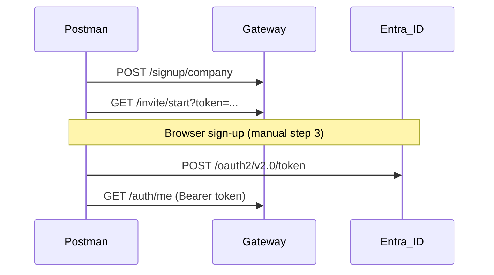

# FGS API — Postman Collections

Postman collections for all FGS microservices, grouped **controller-wise**. Use with the shared **FGS Globals** environment.

## Import into Postman (desktop)

**One-click (Windows):**

```powershell
powershell -ExecutionPolicy Bypass -File docs/api/scripts/Import-PostmanDesktop.ps1
```

This creates `FGS-Postman-Import.zip` (all collections + environment) and opens it in **Postman desktop**. Click **Import** in the preview dialog.

**Manual alternative:**

1. Open Postman desktop → **Import**
2. Drag the folder `docs/api` or file `docs/api/FGS-Postman-Import.zip`
3. Select all 17 items → **Import**
4. Choose environment **FGS Globals (Local)** in the top-right dropdown

## Quick start

1. Import [`FGS-Globals.postman_environment.json`](FGS-Globals.postman_environment.json) into Postman.
2. Select environment **FGS Globals (Local)**.
3. Import the service collection(s) you need (see table below).
4. For protected APIs: run **00 - Authentication Flow** in `UserService.postman_collection.json` first.
5. Set secrets in the environment:
   - `entraClientSecret`
   - `accessToken` (auto-set by auth flow step 4)

## Collections

| Collection | Gateway routes | Direct service URL var |
|------------|----------------|-------------------------|
| [UserService](UserService.postman_collection.json) | auth, invite, signup, dashboard, users/tenants | `userServiceUrl` |
| [SetupService](SetupService.postman_collection.json) | credentials, communication-templates | `setupServiceUrl` (provisioning, business types) |
| [NotificationService](NotificationService.postman_collection.json) | notifications | `notificationServiceUrl` |
| [FileService](FileService.postman_collection.json) | tenants (bucket) | `fileServiceUrl` |
| [AuditService](AuditService.postman_collection.json) | — | `auditServiceUrl` |
| [PublisherService](PublisherService.postman_collection.json) | — | `publisherServiceUrl` |
| [ConsumerService](ConsumerService.postman_collection.json) | — | `consumerServiceUrl` |
| Scaffold services (health) | — | `*ServiceUrl` per service |

Scaffold collections: Asset, Billing, Communication, Crm, Integration, Inventory, Reporting, Scheduling, ServiceAgreement.

## URL conventions

- **Gateway (recommended for public flows):** `https://localhost:8443` → `{{gatewayUrl}}`
- **User tenant admin APIs:** `{{gatewayUrl}}/api/v1/users/tenants/{tenantId}` (nginx rewrite)
- **File tenant storage:** `{{gatewayUrl}}/api/v1/tenants/{tenantId}/bucket`
- **Setup direct APIs:** `{{setupServiceUrl}}/api/v1/...` (tenant provisioning, business types; not exposed via gateway)

## Collection-level configuration

Each collection includes:

- **Bearer auth** at collection level using `{{accessToken}}`
- **Pre-request script** — sets `X-Tenant-Id` and `X-Company-Id` when environment values exist
- Per-request override to **No Auth** for public endpoints (signup, invite, callback, connector, health)

## Regenerate collections

After adding or changing controllers:

```powershell
powershell -ExecutionPolicy Bypass -File docs/api/scripts/Generate-PostmanCollections.ps1
```

## Authentication flow (summary)



See also: [Entra API Connector setup](../entra-api-connector-setup.md)

## Legacy collection

The older single-purpose auth collection at `tools/postman/FGS-UserService-Auth.postman_collection.json` is superseded by `UserService.postman_collection.json` and `FGS-Globals.postman_environment.json` in this folder.
