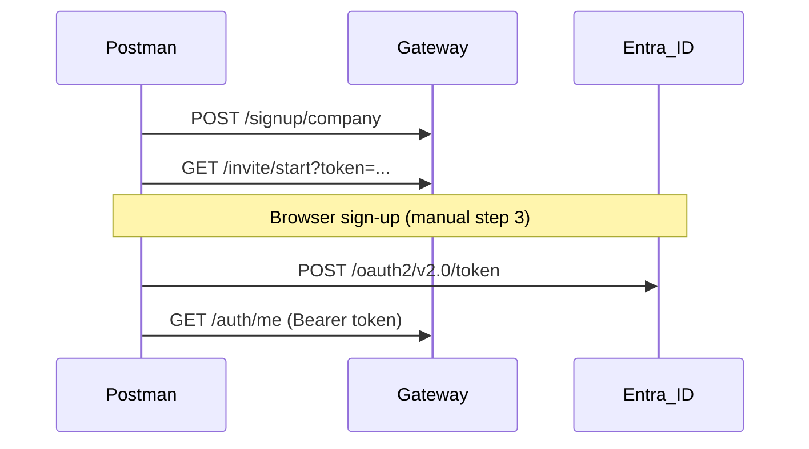

# FGS API — Postman Collections

Postman collections for all FGS microservices, grouped **controller-wise**. Use with the shared **FGS Globals** environment.

## Import into Postman (desktop)

**One-click (Windows):**

```powershell
powershell -ExecutionPolicy Bypass -File docs/api/scripts/Import-PostmanDesktop.ps1
```

This creates `FGS-Postman-Import.zip` (all collections + environment) and opens it in **Postman desktop**. Click **Import** in the preview dialog.

**Manual alternative:**

1. Open Postman desktop → **Import**
2. Drag the folder `docs/api` or file `docs/api/FGS-Postman-Import.zip`
3. Select all items → **Import**
4. Choose environment **FGS Globals (Local)** in the top-right dropdown

## Quick start

1. Import [`FGS-Globals.postman_environment.json`](FGS-Globals.postman_environment.json) into Postman.
2. Select environment **FGS Globals (Local)**.
3. Import the service collection(s) you need (see table below).
4. For protected APIs: run **00 - Authentication Flow** in `UserService.postman_collection.json` first.
5. Set secrets in the environment:
   - `entraClientSecret`
   - `accessToken` (auto-set by auth flow step 4)

## Collections

All request URLs use `{{gatewayUrl}}` (`https://developer.fsm.com`). Per-service URL variables in the environment are kept for direct debugging only. Health-only scaffold services are omitted.

| Collection | Gateway path prefix |
|------------|---------------------|
| [UserService](UserService.postman_collection.json) | `/api/v1/auth`, `/api/v1/invite`, `/api/v1/signup`, `/api/v1/dashboard`, `/api/v1/tenants` |
| [SetupService](SetupService.postman_collection.json) | `/api/v1/{catalog}` (billingcategories, credentials, techtrades, tenantprovisioning, etc.) |
| [NotificationService](NotificationService.postman_collection.json) | `/api/v1/notification/...` |
| [FileService](FileService.postman_collection.json) | `/api/v1/tenant/{tenantId}/bucket`, `/api/v1/attachment` |
| [AuditService](AuditService.postman_collection.json) | `/api/v1/credentialaudit` |
| [FGS Entra Token (Existing User)](FGS-Entra-Token.postman_collection.json) | Entra sign-in + refresh token flow (use with FGS Globals env) |
| [InventoryService](InventoryService.postman_collection.json) | `/api/v1/inventorylocation`, `/api/v1/vendor`, `/api/v1/truckstocktemplate` |
| [AssetService](AssetService.postman_collection.json) | `/api/v1/assettype`, `/api/v1/asset`, `/api/v1/assetattribute`, … |

## Entra token for existing users

Import [`FGS-Entra-Token.postman_collection.json`](FGS-Entra-Token.postman_collection.json) with **FGS Globals (Local)**.

**Graph-audience tokens:** With only `openid profile email` scopes, Entra returns Microsoft Graph access tokens (`aud` = `00000003-0000-0000-c000-000000000000`). These include a proprietary `nonce` in the JWT header that breaks standard signature validation. FGS normalizes this before validation. For new integrations, prefer exposing a custom API scope in Entra (**Expose an API** → `access_as_user`) and requesting `api://{clientId}/access_as_user` so tokens are issued directly for FGS (`aud` = your client id).

**Postman cannot render the Entra login page inside a request response.** Use one of:

### Option A — Manual browser (recommended)
1. Set `entraUserEmail` and `entraClientSecret` in the environment.
2. Entra app registration redirect URI: `https://developer.fsm.com/api/v1/auth/entra/callback` (already in `redirectUri`).
3. Run **Manual browser flow → 1. Copy sign-in URL to console** → copy URL from Postman Console into Chrome/Edge.
4. After sign-in, copy `code=` from the callback URL (`https://developer.fsm.com/api/v1/auth/entra/callback?code=...`) into `authCode`.
5. Run **2. Exchange Authorization Code** → `accessToken` is set automatically.

### Option B — Refresh an existing session
Run **3. Refresh Access Token** if you already have a `refreshToken`.

## URL conventions

- **Gateway (all collections):** `https://developer.fsm.com` → `{{gatewayUrl}}`
- **User tenant admin APIs:** `{{gatewayUrl}}/api/v1/tenants/{tenantId}`
- **File tenant storage:** `{{gatewayUrl}}/api/v1/tenants/{tenantId}/bucket`
- **Setup catalog APIs:** `{{gatewayUrl}}/api/v1/{catalog}` (e.g. `/api/v1/billingcategories`, `/api/v1/credentials`)
- **Per-service URLs** (`setupServiceUrl`, `userServiceUrl`, etc.) remain in the environment for direct container debugging only.

## Collection-level configuration

Each collection includes:

- **Bearer auth** at collection level using `{{accessToken}}`
- **Pre-request script** — sets `X-Tenant-Id` and `X-Company-Id` when environment values exist
- Per-request override to **No Auth** for public endpoints (signup, invite, callback, connector, health)

## Regenerate collections

After adding or changing controllers:

```powershell
powershell -ExecutionPolicy Bypass -File docs/api/scripts/Generate-PostmanCollections.ps1
```

The generator builds request bodies from Create/Update/Patch DTOs and expands **multi-scenario Create requests** where the API has distinct valid shapes (for example pricing-matrix structures, inventory location types, vendor types, credential scopes, job-type `usedFor`, communication channels, asset attribute `inputType`, and attachment logo variants). Each scenario is a separate Postman request with a valid sample body.
## Authentication flow (summary)



See also: [Entra API Connector setup](../entra-api-connector-setup.md)

## Legacy collection

The older single-purpose auth collection at `tools/postman/FGS-UserService-Auth.postman_collection.json` is superseded by `UserService.postman_collection.json` and `FGS-Globals.postman_environment.json` in this folder.
